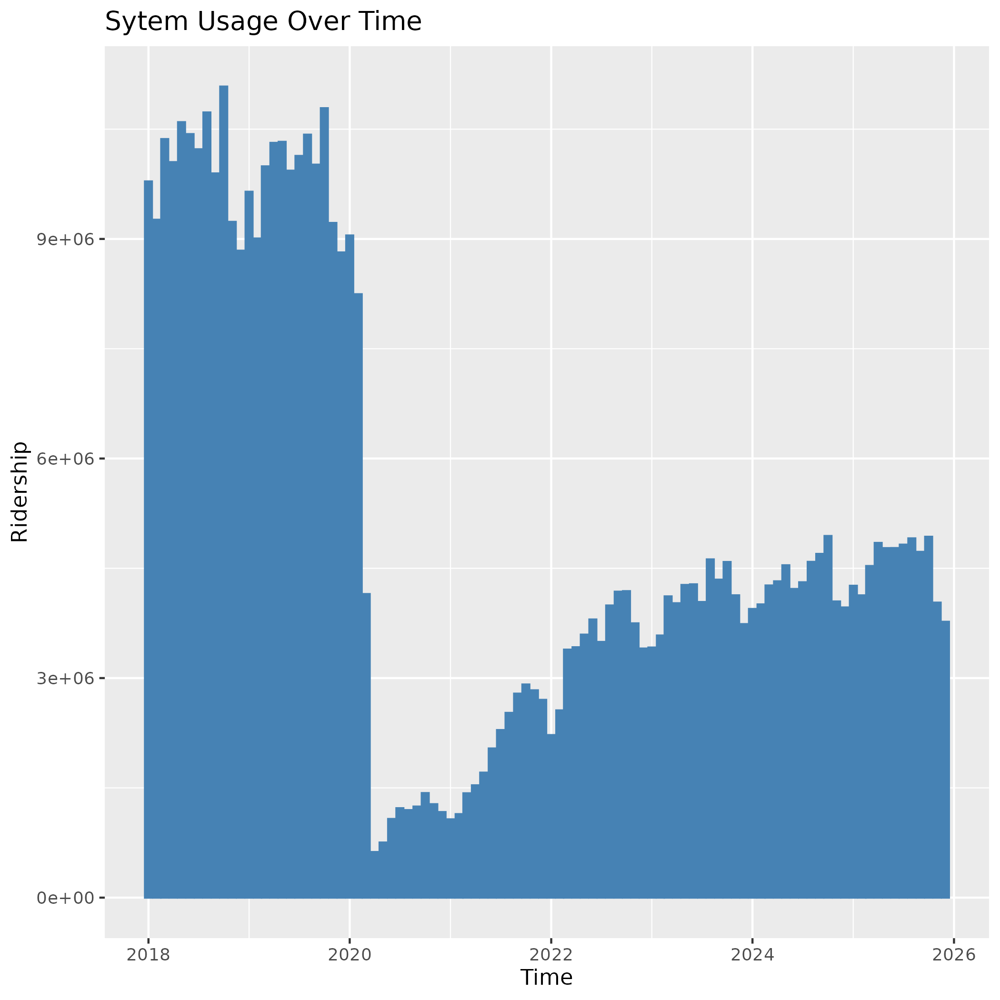
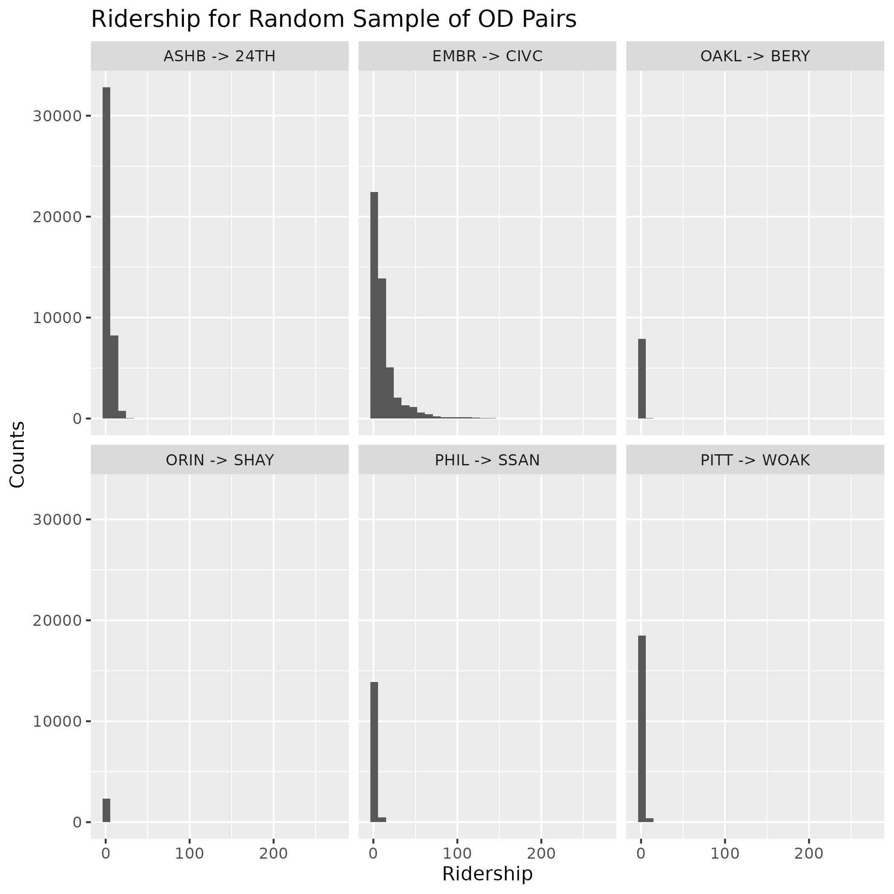
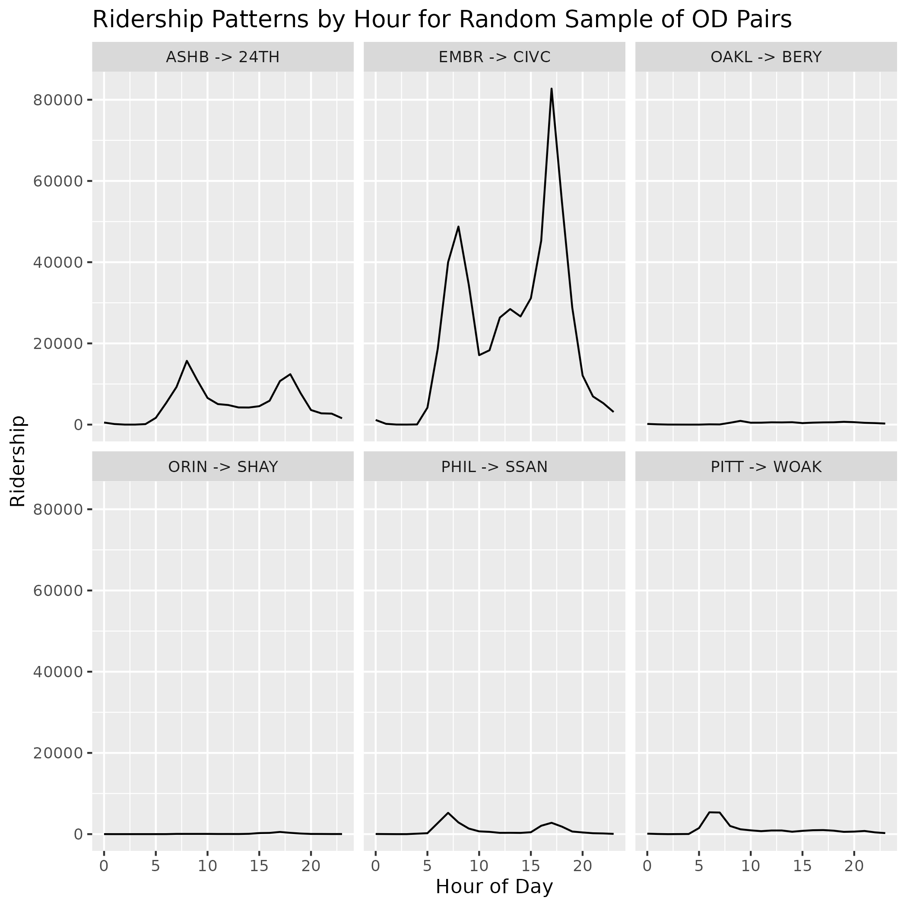

# Introduction:

Bay Area Rapid Transit (BART) services most parts of the San Francisco Bay Area. However, changes in demographics and a sudden drop in ridership placed BART on the back foot. BART navigated the effects of these changes while expanding service to the San Jose area. A model predicting ridership from existing data would be an aid to the agency. Understanding ridership patterns would help set schedules, justify new housing near stations, or guide service reductions. We will take publicly available BART hourly ridership data and use it to construct a linear model that captures trends in ridership over time.

The dataset we chose to work with is large, but sparse in features. We have $67,770,440$ observations, but only $5$ features. Our plan is to use these features to engineer new ones that can extract patterns in the data and use linear modelling principles to evaluate their significance in predicting ridership. How does ridership vary by different features, and to what degree has BART been able to bounce back after the COVID-19 pandemic?

# The Data:

Our data is sourced from BART's [Ridership Reports](https://www.bart.gov/about/reports/ridership). Specifically, the hourly trip datasets, which run from 2018 to 2025. The 2026 dataset has not been updated yet. An observation in our data looks like the following:

| date       | hour | origin | destination | ridership |
|------------|------|--------|-------------|-----------|
| 2018-05-24 | 15   | SBRN   | 19TH        | 5         |

We have the date, hour (using 24-hour clock), the origin station, destination station (both represented as four letter codes), and the ridership.

To demonstrate that we can read our data into R and manipulate it, we group ridership by month and year and plot the overall ridership. This allows us to observe changes in ridership pre- and post-pandemic.

{width=50% height=35% fig-align="center"}

Unsurprisingly, there is a clear discrepancy between the data before 2020 and after lockdowns started to ease in 2022. This distributional shift will need to be accounted for in our model.

# Modelling Plan:

Our model will predict ridership for OD pairs based on features engineered from the data, or join with the data from other sources. Models for transit ridership usually take into account weather on a particular day and population levels near stations, and our data does not include this information. Examples of engineered features include a pre/post COVID-19 indicator, weekday/weekend indicator, transbay tube indicator, ridership from previous hour or week, and a measure of the distance travelled.

Since our data is right skewed and represents counts, we consider using a log-transformed linear model, Poisson model, or negative binomial model. We know the latter two have not been discussed, but we believe they will be covered under general linear models. We will use the 2025 data as a holdout set, and train the models on the 2018 - 2024 data, comparing model performance using MSE. However, there may be consequences to training a model on a mix of data from before, during, and after the COVID-19 pandemic, then testing it on post-pandemic data.

Lastly, we plan to discuss the ways in which this data violates linear modelling assumptions. In particular, homoscedasticity and independence of observations. Often, ridership is predicted using time-series analysis because of distributional shifts and the dependence in sequential data. However, the research question and domain are interesting enough to both of us that we would like to analyse it using methods learned in this class.

\newpage

# Appendix:

{width=60% height=40% fig-align="center"}

{width=60% height=40% fig-align="center"}